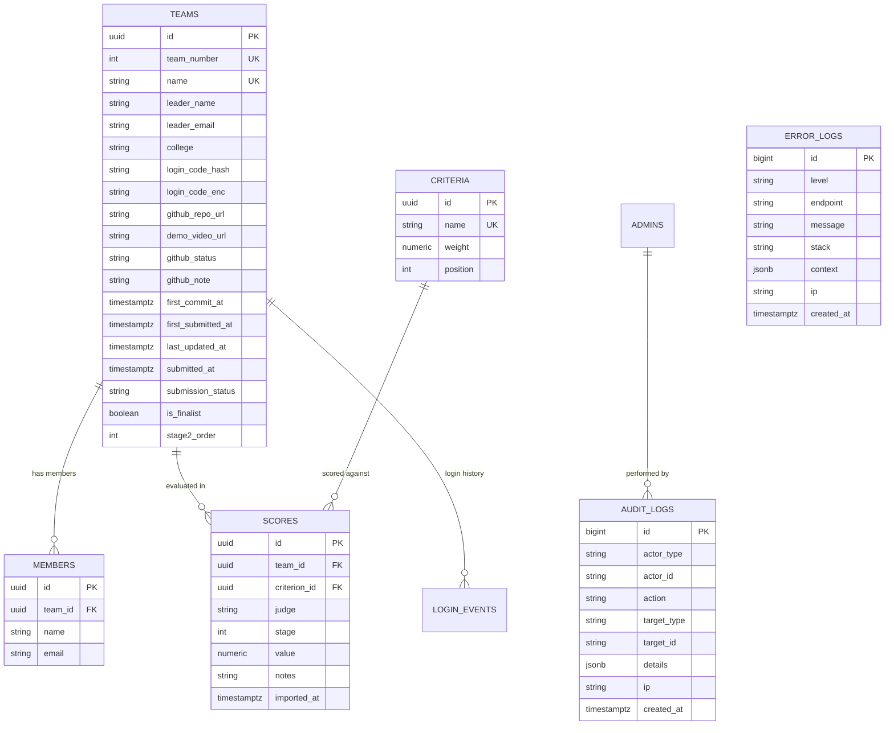

# IEEE SYNAPSE 2026 — Master Codebase & Architecture Guide

> **Target Audience**: AI Agents, Systems Engineers, and Core Maintainers.  
> **Purpose**: Single source of truth containing exhaustive architectural, operational, database, API, and business-logic documentation for the entire repository.

---

## 1. Executive Summary & Event Context

- **Event Name**: IEEE SYNAPSE 2026
- **Organizer**: IEEE Student Branch, AISSMS Institute of Information Technology (IOIT), Pune.
- **Date & Duration**: October 9, 2026 — **6-Hour Offline Build Sprint** (09:00 AM to 03:00 PM IST).
- **Venue**: AISSMS IOIT Campus, Pune, Maharashtra, India.
- **Theme**: *"Build Beyond Code"* (AI & Intelligent Systems, Cybersecurity & Digital Trust, Social Impact & Sustainability, Open Innovation & Emerging Technologies).
- **Platform Scope**:
  - **Pre-event**: Static, high-performance landing page (`/`), rules, timeline, registration status.
  - **Event-day (09:00 – 15:00 IST)**: Phased team deliverable submissions (GitHub Repo + Demo Video), automated GitHub integrity checks, offline paper score digitization.
  - **Judging & Grand Finale (15:00 – 17:30 IST)**: Two-stage scoring pipeline (Stage 1 Preliminary $\to$ Top 10 Finalists $\to$ Stage 2 Live Grand Jury Demos).
  - **Results Reveal (17:30 IST)**: Public Celebration Podium on `/leaderboard` (Top 3 winners & finalists only) with strict privacy safeguards suppressing non-finalist scores to eliminate public score-shaming.

---

## 2. Technical Stack & Design Philosophy

| Layer | Technology | Key Decisions & Rationale |
| :--- | :--- | :--- |
| **Framework** | Next.js 15 (App Router), React 19, TypeScript | Server Components for instant initial paint; minimal client bundles; zero runtime hydration overhead for static sections. |
| **Styling** | Vanilla CSS (`site.css`, `landing.css`) | No Tailwind or component libraries. Pure CSS custom properties (design tokens), glassmorphism, responsive golden-hours sunset theme. |
| **Database** | PostgreSQL (Supabase) | Direct port `5432` for setup/migrations; transaction pooler port `6543` for serverless function concurrency. |
| **DB Client** | `postgres` (`porsager/postgres`) | High-performance, zero-ORM native client with tagged template SQL strings, connection pooling, and SSL enforcement. |
| **Auth System** | Dual Authentication Architecture | 1. **Teams**: Passwordless paper chit tokens (HMAC-SHA256 hash + AES-256-GCM encrypted chit storage).<br>2. **Admins**: Email + bcrypt password hash with signed HTTP-only cookies (`lib/session.ts`). |
| **Integrations**| GitHub REST API (v3) | Monitored commit inspection, commit timestamp cutoff checks, official reviewer collaborator verification (`ieee-synapse-reviewer`). |

---

## 3. Git Branching Model

The project maintains two distinct branch tracks:

1. **`main` (Production Landing Branch)**:
   - Deployed directly to production hosting (e.g., Vercel).
   - Contains marketing pages (`/`, `/about`, `/rules`, `/schedule`).
   - Reflects the live public announcement that registrations are **Closed Early (Housefull)** due to overwhelming participation exceeding venue capacity.
2. **`event_module` (Complete Operational & Backend Branch)**:
   - Contains the full event-day pipeline: phased submissions, Stage 1 & 2 judging, Top 10 finalist selection, private team ranks, audit & error logging, and end-to-end simulation scripts.
   - Merged cleanly with `main` to retain the landing page copy while housing all backend engines.

---

## 4. Directory & File Inventory

```
ieee_synapse_hackathon/
├── app/                                 # Next.js 15 App Router
│   ├── (public pages)
│   │   ├── page.tsx                     # Landing page (GoldenHours scene, chapters, hero CTA)
│   │   ├── about/page.tsx               # Hackathon intro, theme tracks, prizes, eligibility
│   │   ├── rules/page.tsx               # 5 hard rules and weighted judging criteria table
│   │   ├── schedule/page.tsx            # Event-day chronological schedule
│   │   └── leaderboard/page.tsx         # Live leaderboard page wrapper
│   │       └── LiveLeaderboard.tsx      # Celebration Podium UI & privacy-filtered rankings
│   ├── team/                            # Participant Portal
│   │   ├── login/page.tsx               # Team login (Team Number + Chit Code)
│   │   │   └── TeamLoginForm.tsx        # Client form with rate-limiting feedback
│   │   └── dashboard/page.tsx           # Private authenticated team workspace
│   │       └── TeamDashboard.tsx        # Phased submission card & private score breakdown
│   ├── admin/                           # Organizer & Jury Management Panel
│   │   ├── login/page.tsx               # Admin login form
│   │   ├── print/page.tsx               # Printable credential chits (for check-in desk)
│   │   └── (panel)/                     # Authenticated admin panel routes
│   │       ├── layout.tsx & AdminTabs.tsx # Admin sub-navigation tabs
│   │       ├── page.tsx                 # Real-time event statistics & control switches
│   │       ├── import/page.tsx          # CSV importer (Unstop roster upload wizard)
│   │       ├── teams/page.tsx           # All teams table, GitHub flags, status actions
│   │       ├── scores/page.tsx          # Criteria editor & offline sheet score importer
│   │       ├── leaderboard/page.tsx     # Grand reveal controls & podium settings
│   │       ├── send-credentials/page.tsx# Resend codes / lookup lost chit credentials
│   │       └── logs/page.tsx            # Audit & runtime error log inspection console
│   │           └── LogsViewer.tsx       # Searchable, filterable audit & error log UI
│   ├── api/                             # REST API Endpoints
│   │   ├── health/route.ts              # System health & uptime check
│   │   ├── leaderboard/route.ts         # Public leaderboard API (finalists only)
│   │   ├── team/
│   │   │   ├── login/route.ts           # Team code verification & session issuance
│   │   │   ├── logout/route.ts          # Clear team cookie
│   │   │   ├── me/route.ts              # Fetch current team status & submission data
│   │   │   ├── repo/route.ts            # Save/update GitHub repository URL
│   │   │   ├── video/route.ts           # Save/update Demo Video URL (Hour 4 unlock)
│   │   │   └── submit/route.ts          # Final submission lock (cutoff: 15:00:00 IST)
│   │   └── admin/
│   │       ├── login/route.ts           # Admin login verification (bcrypt)
│   │       ├── logout/route.ts          # Clear admin cookie
│   │       ├── import/route.ts          # Bulk team import from CSV + chit code generation
│   │       ├── teams/route.ts           # Team actions (disqualify, reinstate, regenerate)
│   │       ├── scores/route.ts          # Bulk score importer (Stage 1 & Stage 2 toggle)
│   │       ├── settings/route.ts        # Event settings & reveal toggles
│   │       ├── reset/route.ts           # Danger zone database wipe
│   │       └── logs/route.ts            # Query audit_logs and error_logs
│   ├── globals.css & site.css           # Base styling, admin layout, table styles, pills
│   └── landing.css                      # Landing page design tokens, animations, scrollbar
├── components/                          # Reusable UI Components
│   ├── SiteHeader.tsx & InnerShell.tsx  # Global responsive navigation header & shell
│   ├── icons.tsx                        # SVG icons (Sparkle, Lock, Chevron, etc.)
│   └── landing/                         # Landing page specific components
│       ├── Chapters.tsx                 # 6 chapters (Sunrise, Morning, Midday, Golden, Dusk)
│       ├── GoldenHours.tsx & Horizon.tsx# Dynamic SVG sunset/horizon sky backdrop
│       ├── PhaseLink.tsx                # Phase-aware CTA link (pre vs live vs closed)
│       └── StickyRegisterBar.tsx        # Mobile pinned sticky action bar
├── db/                                  # Database Schema & Migrations
│   ├── schema.sql                       # Base schema (teams, members, criteria, scores, admins, settings)
│   └── migrations/
│       ├── 001_eventday_updates.sql     # Phased submission columns, Stage 1/2 scores, finalists
│       ├── 002_clean_criteria.sql       # Enforced confirmed 7 criteria summing to exactly 100%
│       └── 003_audit_and_error_logs.sql # audit_logs and error_logs tables with RLS
├── lib/                                 # Shared Core Modules
│   ├── admin-teams.ts                   # Queries for admin team table with computed metrics
│   ├── codes.ts                         # Chit generation, HMAC hashing, AES-256-GCM encryption
│   ├── criteria.ts                      # Criterion fetching & validation
│   ├── cta.ts                           # Dynamic header CTA determination
│   ├── db.ts                            # Pooled PostgreSQL connection instance
│   ├── event.ts                         # Single source of truth for event constants & rules
│   ├── format.ts                        # Date, time, score, and currency formatting helpers
│   ├── github.ts                        # GitHub API client (commits, README, collaborator checks)
│   ├── http.ts                          # JSON response helpers (`ok`, `fail`, `adminRoute`, `clientInfo`)
│   ├── logger.ts                        # Non-blocking `logAudit` and `logError` utilities
│   ├── scoring.ts                       # Stage-aware score calculation & tie-breaking engine
│   ├── session.ts                       # HMAC-signed HTTP-only session cookies
│   ├── settings.ts                      # Key-value event configuration storage
│   └── team.ts                          # Participant dashboard metrics & private rank queries
├── scripts/                             # Utility, Setup, & Simulation Scripts
│   ├── db-setup.mjs                     # Runs schema.sql and sequentially applies all migrations
│   ├── create-admin.mjs                 # Interactive CLI to create an organizer admin user
│   ├── accept-invites.mjs               # GitHub bot script to bulk accept collaborator invitations
│   ├── generate-mock-csv.ts             # Generates realistic 100-team Unstop CSV dataset
│   ├── simulate-eventday.ts / .mjs      # End-to-end event-day simulation test harness
│   └── test-conn.mjs                    # Supabase database connectivity tester
└── mock_unstop_100_teams.csv            # 100-team test roster for stress testing
```

---

## 5. Database Architecture & Migrations

### A. Core Relational Tables



### B. Confirmed Evaluation Criteria (100% Total)
Migrated via `002_clean_criteria.sql`:
1. **Innovation**: 20.00%
2. **Technical Implementation**: 25.00%
3. **Functionality**: 20.00%
4. **Problem Relevance**: 15.00%
5. **Creativity**: 10.00%
6. **Demo & Explanation**: 5.00%
7. **Overall Impact**: 5.00%

### C. Migration History
1. **`001_eventday_updates.sql`**: Added `demo_video_url`, `first_submitted_at`, `last_updated_at`, `is_finalist`, `stage2_order` to `teams`, and `stage` (1 or 2) to `scores`.
2. **`002_clean_criteria.sql`**: Removed test/legacy criteria rows and reset weights to the official 7 criteria totaling exactly 100%.
3. **`003_audit_and_error_logs.sql`**: Added `audit_logs` and `error_logs` tables with indexes and Row-Level Security revoking public permissions.

---

## 6. Authentication & Security Model

### A. Team Authentication (Paper Chits)
- **Code Format**: `SYNAPSE-XXXXXX` (6-character uppercase alphanumeric body excluding ambiguous characters `0`, `O`, `1`, `I`, `L`).
- **Hash for Verification**: `createHmac("sha256", deriveKey("hash")).update(normalizeCode(code)).digest("hex")`.
- **Encryption for Chit Recovery**: `AES-256-GCM` using key derived via HKDF-SHA256 from `CODE_SECRET`. Admins can decrypt and read codes back to teams that lost paper chits (`/admin/send-credentials`).
- **Brute-Force Lockout**: 5 failed attempts locks team for 10 minutes (`failed_attempts`, `locked_until`).
- **Session**: Signed HTTP-only cookie `team_session` containing `{ teamId, teamNumber, name }`.

### B. Admin Authentication
- Admin users stored in `admins` table with bcrypt-hashed passwords.
- Session stored in signed HTTP-only cookie `admin_session`.
- CSRF protection: All mutating routes enforce JSON Content-Type and verify origin header against request host (`lib/http.ts`).

---

## 7. Core Workflows & Business Rules

### 1. Phased Submissions & Hard Deadline Lock
- **Hour 0 to Hour 4 (09:00 AM – 01:00 PM)**: Teams submit their GitHub repository URL. Demo video input remains disabled with a countdown timer to prevent rushed mockups.
- **Hour 4 to Hour 6 (01:00 PM – 03:00 PM)**: Demo Video URL field unlocks. Allowed hosts strictly validated: `youtube.com`, `youtu.be`, `drive.google.com`, `loom.com`, `vimeo.com`.
- **Cutoff Enforcement (15:00:00 IST)**: Evaluated server-authoritatively against `submissionDeadline` from settings. Any mutation arriving at or after 15:00:00 is rejected with HTTP 403.
- **Tie-Breaker Rule**: `first_submitted_at` is set on first save and never updated on subsequent edits. In event of score ties, earlier `first_submitted_at` wins.

### 2. GitHub Integrity Checking Engine (`lib/github.ts`)
- **First Commit Audit**: Parses commit log. If initial commit is before 09:00:00 AM IST, sets `github_status = 'flagged'`.
- **Reviewer Collaborator Audit**: Verifies that official reviewer `ieee-synapse-reviewer` is added as collaborator. Automated background bot (`scripts/accept-invites.mjs`) bulk-accepts all pending invitations using GitHub API tokens.
- **README Validation**: Checks for presence and size of root `README.md`.

### 3. Two-Stage Scoring Pipeline
- **Stage 1 (Preliminary Evaluation)**:
  - All teams scored by judges across all 7 criteria.
  - Overall team score calculated as weighted sum across criteria.
  - Organizers select Top 10 teams (`is_finalist = true`, `stage2_order = 1..10`).
- **Stage 2 (Grand Final Live Demos)**:
  - Top 10 finalists present live demos on stage to Grand Jury.
  - Grand Jury enters Stage 2 scores (`stage = 2`).
  - Final podium positions (1st, 2nd, 3rd) determined exclusively by Stage 2 scores (tie-broken by `first_submitted_at`).

### 4. Ethical Leaderboard & Anti-Score-Shaming Rules
- **Pre-Reveal State**: When `leaderboard_visible = false`, public leaderboard displays a friendly holding card (*"Results at 5:30 PM — Check back soon"*).
- **Post-Reveal State**: When `leaderboard_visible = true`, public leaderboard displays:
  - 🥇 Winner (1st Place Card)
  - 🥈 Runner-Up (2nd Place Card)
  - 🥉 2nd Runner-Up (3rd Place Card)
  - Remaining Top Finalists Table
- **Strict Privacy Guard**: Non-finalist teams are **never** rendered on `/leaderboard` or returned by `/api/leaderboard`. Non-finalists see their private rank (`Rank #X of 100 teams`) and detailed criterion breakdown exclusively on their authenticated `/team/dashboard`.

### 5. Audit & Error Logging Architecture (`lib/logger.ts`)
- **`logAudit()`**: Logs actions (`TEAMS_IMPORT`, `SCORES_IMPORT`, `SETTINGS_UPDATE`, `TEAM_DISQUALIFY`, `REPO_UPDATED`, `VIDEO_UPDATED`, `SUBMISSION_FINALIZED`) to `audit_logs`.
- **`logError()`**: Non-blocking capture of unhandled exceptions, route failures, stack traces, request payloads, and IP origins to `error_logs`.
- **Admin Console**: Real-time log inspector at `/admin/logs` with KPI counters, audit/error tabs, search filters, and expandable trace payloads.

---

## 8. Complete API Reference

| Endpoint | Method | Auth | Description & Behavior |
| :--- | :--- | :--- | :--- |
| `/api/health` | `GET` | Public | System health check; confirms database connection. |
| `/api/leaderboard` | `GET` | Public | Returns `{ visible, finalists: [...] }`. Suppresses non-finalists. |
| `/api/team/login` | `POST` | Public | Body: `{ teamNumber, code }`. Rate-limited (5 attempts). Sets session cookie. |
| `/api/team/logout` | `POST` | Team | Clears team session cookie. |
| `/api/team/me` | `GET` | Team | Returns team profile, submission status, deliverables, and private scores. |
| `/api/team/repo` | `POST` | Team | Body: `{ url }`. Saves GitHub URL; enforces 15:00:00 cutoff. |
| `/api/team/video` | `POST` | Team | Body: `{ url }`. Saves Demo Video URL; validates video domains; enforces cutoff. |
| `/api/team/submit` | `POST` | Team | Locks submission; triggers background GitHub inspection via `after()`. |
| `/api/admin/login` | `POST` | Public | Body: `{ email, password }`. Verifies bcrypt password; sets admin cookie. |
| `/api/admin/logout` | `POST` | Admin | Clears admin session cookie. |
| `/api/admin/import` | `POST` | Admin | Body: `{ teams, dryRun }`. Parses roster, generates codes, creates teams. |
| `/api/admin/teams` | `POST` | Admin | Body: `{ action, ids }`. Actions: `disqualify`, `reinstate`, `regenerate-code`, `delete`. |
| `/api/admin/scores` | `POST` | Admin | Body: `{ rows, stage, replaceAll, dryRun }`. Digitizes paper judge score sheets. |
| `/api/admin/settings` | `PUT` | Admin | Body: `{ leaderboardVisible, scoresVisible, themeRevealed, ... }`. |
| `/api/admin/logs` | `GET` | Admin | Query: `?tab=audit\|error&q=...`. Returns logs and operational statistics. |
| `/api/admin/reset` | `POST` | Admin | Body: `{ scope: "scores"\|"everything", confirm: "DELETE" }`. Danger zone wipe. |

---

## 9. Simulation & Verification Scripts

The repository includes a complete test harness simulating the entire hackathon event day from start to finish:

```bash
# 1. Apply database migrations
npm run db:setup

# 2. Run the 100-team end-to-end event day simulation
node scripts/simulate-eventday.mjs
```

### What `simulate-eventday.mjs` Does:
1. Cleans previous test scores and teams.
2. Imports `mock_unstop_100_teams.csv` (100 realistic teams from Pune colleges).
3. Generates credentials and hashes for Teams `#101` to `#200`.
4. Simulates phased submissions (GitHub URLs + Demo Video links with variance and timestamp distributions).
5. Injects 2,100 Stage 1 preliminary evaluation marks across all 7 criteria from 3 judges.
6. Computes Stage 1 rankings with tie-breaking and selects Top 10 Finalists.
7. Simulates Grand Jury Stage 2 live demo presentations for the 10 finalists.
8. Flips the reveal switch and verifies the Grand Podium (🥇, 🥈, 🥉).
9. Queries a random non-finalist team to assert that private ranks are viewable on `/team/dashboard` while remaining strictly hidden from the public leaderboard.

---

## 10. Environment Variables (`.env.local`)

| Variable | Description | Example / Format |
| :--- | :--- | :--- |
| `DATABASE_URL` | PostgreSQL connection string (Supabase transaction pooler, port 6543) | `postgresql://postgres.[REF]:[PASSWORD]@[HOST]:6543/postgres` |
| `CODE_SECRET` | 32+ char random secret for deriving chit hash/encryption keys | `<random, 48+ chars, never reuse an example>` |
| `SESSION_SECRET` | 32+ char random secret for signing team and admin session cookies | `<random, 48+ chars, different from CODE_SECRET>` |
| `GITHUB_TOKEN` | Read-only GitHub token for checking public repo commits (no write scopes) | `<fine-grained token, public repos read-only>` |
| `NEXT_PUBLIC_SITE_URL` | Canonical public URL; used in emails, chits, canonical and og:image. Baked in at build time, so redeploy after changing it | `https://ieee-synapse-2026.vercel.app` |

---

## 11. How to Spin Up & Work on this Codebase

```bash
# Install dependencies
npm install

# Setup database & apply migrations
npm run db:setup

# Create the first organizer admin user
npm run admin:create

# Start local development server
npm run dev

# Run TypeScript type check across whole project
npx tsc --noEmit

# Run production build validation
npm run build
```

---
*Document maintained by IEEE IOIT Synapse Core Engineering Team.*
